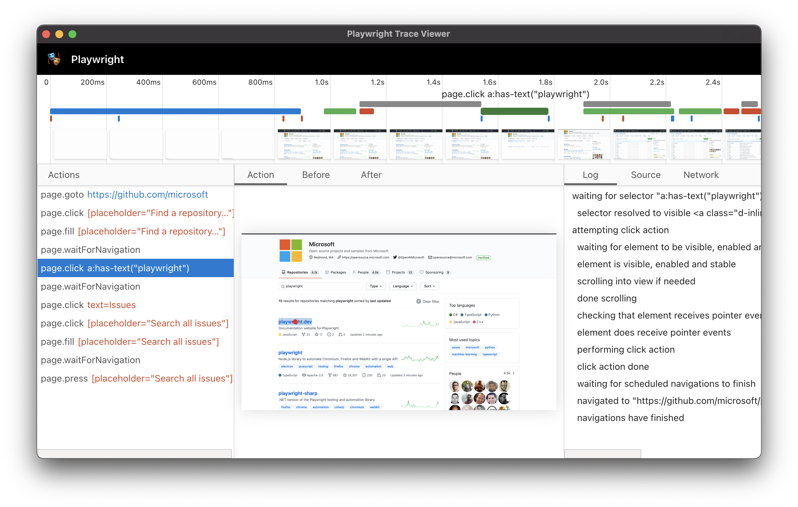

class: center, middle

<!-- 

    cd /mnt/windows/mariohuq/Desktop/technopolis/autotests/
    python -m http.server

    .left-half[

    ### ...

    ...

    ]

    .right-half[ 

    ...

    ]

    --

    to sequentially show

 -->

#  [Playwright](https://playwright.dev)

Кондраев Дмитрий

---

## Marketing

Playwright is a framework for Web Testing and Automation. It allows testing
[Chromium](https://www.chromium.org/Home),
[Firefox](https://www.mozilla.org/en-US/firefox/new/) and
[WebKit](https://webkit.org/) with a single API.
Playwright is built to enable cross-browser web automation that is
**ever-green**, **capable**, **reliable** and **fast**.

--

### Поддерживаемые платформы

|          | Linux\*\* | macOS | Windows |
|   :---   | :---: | :---: | :---:   |
| Chromium <!-- GEN:chromium-version -->102.0.5005.49<!-- GEN:stop -->\* | ✅ | ✅ | ✅ |
| WebKit <!-- GEN:webkit-version -->15.4<!-- GEN:stop -->\* | ✅ | ✅ | ✅ |
| Firefox <!-- GEN:firefox-version -->99.0.1<!-- GEN:stop -->\* | ✅ | ✅ | ✅ |

--

### Поддерживаемые языки

[TypeScript](https://playwright.dev/docs/intro),
[JavaScript](https://playwright.dev/docs/intro),
[Python](https://playwright.dev/python/docs/intro),
[.NET](https://playwright.dev/dotnet/docs/intro),
[Java](https://playwright.dev/java/docs/intro).

.footnote[
\* На 23.05.2022

\*\* Заявлена поддержка только Ubuntu 18.04 и Ubuntu 20.04
]

---

## Установка

<!-- 

fedora:

dnf provides libpcre.so
dnf provides libicui18n.so
dnf provides libicuuc.so
dnf provides libjpeg.so
dnf provides libwebp.so
dnf provides libffi.so 

https://github.com/microsoft/playwright-java
https://playwright.dev/java/docs/screenshots
https://playwright.dev/java/docs/codegen
https://playwright.dev/java/docs/intro#installation
https://playwright.dev/java/docs/intro
https://github.com/microsoft/playwright/blob/main/README.md
https://playwright.dev/java/
 -->

`pom.xml`

```xml
<?xml version="1.0" encoding="UTF-8"?>
<project xmlns="http://maven.apache.org/POM/4.0.0"
         xmlns:xsi="http://www.w3.org/2001/XMLSchema-instance"
         xsi:schemaLocation="http://maven.apache.org/POM/4.0.0 http://maven.apache.org/xsd/maven-4.0.0.xsd">
    <modelVersion>4.0.0</modelVersion>
    <groupId>company.vk</groupId>
    <artifactId>playwright-example</artifactId>
    <version>1.0-SNAPSHOT</version>
    <properties>
        <maven.compiler.source>18</maven.compiler.source>
        <maven.compiler.target>18</maven.compiler.target>
    </properties>
    <dependencies>
        <dependency>
            <groupId>com.microsoft.playwright</groupId>
            <artifactId>playwright</artifactId>
            <version>1.22.0</version>
        </dependency>
    </dependencies>
</project>
```

---

## CLI Tools

- `install --help` — install supported browsers
- `codegen ok.ru [--save-storage=auth.json]` — [generate](https://playwright.dev/java/docs/codegen) Java code for user actions and save cookies etc.
- `open ok.ru [--load-storage=auth.json]` — load page with saved credentials
- `show-trace trace.zip` — show recorded trace
- `screenshot --help` — screenshot tool
- `pdf ok.ru/help help.pdf` — pdf print tool*

```bash
mvn exec:java -e \
  -Dexec.mainClass=com.microsoft.playwright.CLI\
  -Dexec.args="<PASTE_HERE>"
```

--

.footnote[
\* Chromium only
]

---

## Emulate...

- `open --device="Galaxy S III" ok.ru` — mobile or tablet [device](https://github.com/microsoft/playwright/blob/f1307f4a4d92490d7d0e7ee5a6a7fe9a22804e86/packages/playwright-core/src/server/deviceDescriptorsSource.json)
- `open --viewport-size=800,600 --color-scheme=dark` — color scheme and viewport size
- `open --timezone="Asia/Novosibirsk"` — timezone
- `open --geolocation="60.006733,30.378772"` — location
- `open --lang="ru-RU"` — language

```bash
mvn exec:java -e \
  -Dexec.mainClass=com.microsoft.playwright.CLI\
  -Dexec.args="<PASTE_HERE>"
```

---

## Trace API

```java
// browserType = playwright.chromium()
try (Browser browser = browserType.launch()) {
    BrowserContext context = browser.newContext();
    // Start tracing before creating / navigating a page.
    context.tracing().start(new Tracing.StartOptions()
      .setScreenshots(true)
      .setSnapshots(true)
*     .setSources(true));// Need PLAYWRIGHT_JAVA_SRC env var

    Page page = context.newPage();
    page.navigate("https://ok.ru");
    // Do action
    page.click("a.anon-toolbar-nav_link-item-link");

    // Stop tracing and export it into a zip archive.
    context.tracing().stop(new Tracing.StopOptions()
      .setPath(Paths.get("trace.zip")));
}
```

---

## Trace Viewer



---

## Launching options

```java
BrowserType chromium = playwright.chromium();
chromium.launch(new BrowserType.LaunchOptions()
    .setHeadless(false)
    .setDevtools(true) // auto-open a DevTools panel*
                       // implies headed mode
    .setSlowMo(100) // Замедление операций Playwright на 100 ms
    .setTimeout(30000) // Playwright будет запускать
                       // браузер не дольше 30 с
    .setProxy(new Proxy("socks5://myproxy.com:3128")
        .setUsername("admin")
        .setPassword("qwerty")))
```

.footnote[
\* Chromium only
]

---

# API

- `Playwright` (launch a browser)
- `BrowserType` (launch a specific browser instance)
- `Browser` (open new page)
- `Page` (interact with a single tab)
- `Locator` (way to find element)
- `Selector` (custom selector engine)
- `Assertions` (Web-First Assertions)

---

## `Playwright` interface

```java
Playwright create(..);
void close();

*BrowserType chromium();
*BrowserType firefox();
*BrowserType webkit();

APIRequest request(); // Web API testing

Selectors selectors(); 
```

---

## `BrowserType` interface

```java
Browser connect(...);
Browser launch(...);
String name();
```

---

## `Browser` interface

```java
void close();
Page newPage(...);
void startTracing(...);
byte[] stopTracing(); // encoded JSON
```

---

## `Page` interface

```java
// подписаться на событие ()
page.onLoad(p -> System.out.println("Page loaded!"));
```

Поддерживает все типы JS событий: `Close`, `ConsoleMessage`, `Crash`, `Dialog`, `DOMContentLoaded`, `Download`, `FileChooser`, `FrameAttached`, `FrameDetached`, `FrameNavigated`, `Load`, `PageError`, `Popup`, `Request`, `RequestFailed`, `RequestFinished`, `Response`, `WebSocket`, `Worker`.

--

```java
void check(String selector, CheckOptions options); // общая проверка элемента:
    // Attached && Visible && Stable &&  && Receives Events && Enabled
```

```java
void click(String selector, ClickOptions options);
```

```java
boolean isClosed();
// проверки для элементов
boolean isChecked(String selector[, IsCheckedOptions options]);
boolean isDisabled(String selector[, IsDisabledOptions options]);
boolean isEditable(String selector[, IsEditableOptions options]);
boolean isEnabled(String selector[, IsEnabledOptions options]);
boolean isHidden(String selector[, IsHiddenOptions options]);
boolean isVisible(String selector[, IsVisibleOptions options]);
```

---

```java
Page waitForClose([WaitForCloseOptions options],  Runnable callback);
```

--

`Close`, `ConsoleMessage`, `Download`, `FileChooser`, `Function`, `LoadState`, `Navigation`, `Popup`, `Request`, `RequestFinished`, `Response`, `Selector`, `Timeout`, `URL`, `WebSocket`, `Worker`

---

## Примеры

```java
page.locator("text=Log in").click(); // text
```
--
```java
page.locator("#nav-bar .contact-us-item").click(); // CSS
```
--
```java
page.locator("[aria-label='Sign in']").click(); // attribute
```
--
```java
page.locator("#nav-bar :text(\"Contact us\")").click(); // combine
```
--
```java
page.locator(":nth-match(:text('Buy'), 3)").click(); // n-th match
```
--
```java
page.locator("xpath=//button").click(); // XPath
```
--
```java
page.locator("_react=ListItem[text *= 'milk' i]").click(); // React (experimental)
```
--
```java
page.locator("_vue=list-item[text *= 'milk' i]").click(); // Vue (experimental)
```

---

## `Locator` interface

```java
Locator locator = page.locator("text=Submit");
locator.hover(); // найдет элемент
locator.click(); // еще раз найдет элемент
```
--
```java
// бросит исключение, если найдет несколько элементов
```

---

## Filtering locator

Текст:

```java
page.locator("button", new Page.LocatorOptions().setHasText("Sign up")).click();
```

Потомки:

--
```java
page.locator("article", new Page.LocatorOptions().setHas(page.locator("button.subscribe")));
```

---

## `Assertions` interface

```java
import static com.microsoft.playwright.assertions.PlaywrightAssertions.assertThat;
```

```java
page.click("#submit-button");
assertThat(page.locator(".status")).hasText("Submitted");
```

```java
assertThat(locator).isChecked([options])
assertThat(locator).isDisabled([options])
assertThat(locator).isEditable([options])
assertThat(locator).isEmpty([options])
assertThat(locator).isEnabled([options])
assertThat(locator).isFocused([options])
assertThat(locator).isHidden([options])
assertThat(locator).isVisible([options])
assertThat(locator).containsText(expected[, options])
assertThat(locator).hasAttribute(name, value[, options])
assertThat(locator).hasClass(expected[, options])
assertThat(locator).hasCount(count[, options])
assertThat(locator).hasCSS(name, value[, options])
assertThat(locator).hasId(id[, options])
assertThat(locator).hasJSProperty(name, value[, options])
assertThat(locator).hasText(expected[, options])
```
---
```java
assertThat(locator).hasValue(value[, options])
assertThat(locator).not()
assertThat(page).hasTitle(titleOrRegExp[, options])
assertThat(page).hasURL(urlOrRegExp[, options])
assertThat(page).not()
```

---

## Автоматические ожидания и retries

| Action | [Attached](https://playwright.dev/java/docs/actionability#attached "Attached") | [Visible](https://playwright.dev/java/docs/actionability#visible "Visible") | [Stable](https://playwright.dev/java/docs/actionability#stable "Stable") | [Receives Events](https://playwright.dev/java/docs/actionability#receives-events "Receives Events") | [Enabled](https://playwright.dev/java/docs/actionability#enabled "Enabled") | [Editable](https://playwright.dev/java/docs/actionability#editable "Editable") |
| :-- | :-: | :-: | :-: | :-: | :-: | :-: |
| check | Yes | Yes | Yes | Yes | Yes | - |
| click | Yes | Yes | Yes | Yes | Yes | - |
| dblclick | Yes | Yes | Yes | Yes | Yes | - |
| setChecked | Yes | Yes | Yes | Yes | Yes | - |
| tap | Yes | Yes | Yes | Yes | Yes | - |
| uncheck | Yes | Yes | Yes | Yes | Yes | - |
| hover | Yes | Yes | Yes | Yes | - | - |
| scrollIntoViewIfNeeded | Yes | - | Yes | - | - | - |
| screenshot | Yes | Yes | Yes | - | - | - |
| fill | Yes | Yes | - | - | Yes | Yes |
| selectText | Yes | Yes | - | - | - | - |
| dispatchEvent | Yes | - | - | - | - | - |
| focus | Yes | - | - | - | - | - |
| getAttribute | Yes | - | - | - | - | - |
| innerText | Yes | - | - | - | - | - |
| innerHTML | Yes | - | - | - | - | - |


---

| Action | [Attached](https://playwright.dev/java/docs/actionability#attached "Attached") | [Visible](https://playwright.dev/java/docs/actionability#visible "Visible") | [Stable](https://playwright.dev/java/docs/actionability#stable "Stable") | [Receives Events](https://playwright.dev/java/docs/actionability#receives-events "Receives Events") | [Enabled](https://playwright.dev/java/docs/actionability#enabled "Enabled") | [Editable](https://playwright.dev/java/docs/actionability#editable "Editable") |
| :-- | :-: | :-: | :-: | :-: | :-: | :-: |
| press | Yes | - | - | - | - | - |
| setInputFiles | Yes | - | - | - | - | - |
| selectOption | Yes | - | - | - | - | - |
| textContent | Yes | - | - | - | - | - |
| type | Yes | - | - | - | - | - |

???
https://playwright.dev/java/docs/actionability

---

## Page object example

```java
package models;

import com.microsoft.playwright;

public class SearchPage {
  private final Page page;
  private final Locator searchTermInput;

  public SearchPage(Page page) {
    this.page = page;
    this.searchTermInput = page.locator("[aria-label='Enter your search term']");
  }

  public void navigate() {
    page.navigate("https://bing.com");
  }

  public void search(String text) {
    searchTermInput.fill(text);
    searchTermInput.press("Enter");
  }
}
```

---

## Special

--

### Record video

```java
context = browser.newContext(new Browser.NewContextOptions()
    .setRecordVideoDir(Paths.get("videos/")));
// ...
context.close(); // закрытие контекста требуется для сохранения видео
```

Доступ к имени файла видео

```java
path = page.video().path();
```

---

## Полезные ссылки

- Docs (java variant) <https://playwright.dev/java/docs/intro>
- Playwright <https://github.com/microsoft/playwright>
- playwright-java: <https://github.com/microsoft/playwright-java>
- Проект с примерами: <https://github.com/microsoft/playwright-java/tree/main/examples>